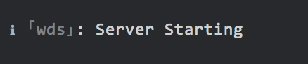

[![npm][npm]][npm-url]
[![node][node]][node-url]
[![deps][deps]][deps-url]
[![test][test]][test-url]
[![coverage][cover]][cover-url]
[![chat][chat]][chat-url]

<div align="center">
  
  <a href="https://github.com/webpack/webpack">
    
  </a>
  <h1>webpack Log</h1>
  <p>A common logging module for the webpack ecosystem</p>
</div>

## Install

```bash
npm i -D webpack-log
```

> ⚠️ We do not recommend installing this module globally

## Usage

```js
const log = require('webpack-log');
const logger = log({ name: 'wds' });

logger.info('Server Starting');
```



> ℹ️ The logger returned is unique by default, due to the nature of the `webpack` ecosystem. Please reference the [`unique`](#unique) option below for disabling this feature and to **force caching**

## Options

|             Name              |    Type     |    Default     | Description             |
| :---------------------------: | :---------: | :------------: | :---------------------- |
|      [**`name`**](#name)      | `{String}`  | `''<unknown>'` | Log Name (**Required**) |
|     [**`level`**](#level)     | `{String}`  |    `'info'`    | Log Level               |
|    [**`unique`**](#unique)    | `{Boolean}` |     `true`     | Log Uniqueness          |
| [**`timestamp`**](#timestamp) | `{Boolean}` |    `false`     | Log Timestamps          |

### `name`

Specifies the name of the log to create. **This option is required**, and used to differentiate between loggers when `webpack-log` is used in multiple projects
executing in the same process

```js
const logger = log({ name: 'wds' });
```

### `level`

Specifies the level the logger should use. A logger will not produce output for
any log level _beneath_ the specified level. Available levels and order are:

```js
['info', 'warn', 'error', 'trace', 'debug', 'silent'];
```

```js
const logger = log({ level: 'error' });

logger.error(err);
```

> ℹ️ The level names shown above correspond to the available logging methods,
> with the notable exception of the `silent` level

### `unique`

If `false`, instructs the logger to used cached versions of a log with the same name. Due to the nature of the `webpack` ecosystem and multiple plugin/loader usage in the same process, loggers are created as unique instances by default. By passing `false` for this property, the module is instructed to cache the requested logger

```js
const logger = log({ unique: true });
```

### `timestamp`

If `true`, instructs the logger to display a timestamp for log output, preceding
all other data

```js
const logger = log({ timestamp: true });
```

[npm]: https://img.shields.io/npm/v/webpack-log.svg
[npm-url]: https://npmjs.com/package/webpack-log
[node]: https://img.shields.io/node/v/webpack-log.svg
[node-url]: https://nodejs.org
[deps]: https://david-dm.org/webpack-contrib/webpack-log.svg
[deps-url]: https://david-dm.org/webpack-contrib/webpack-log
[test]: http://img.shields.io/travis/webpack-contrib/webpack-log.svg
[test-url]: https://travis-ci.org/webpack-contrib/webpack-log
[cover]: https://codecov.io/gh/webpack-contrib/webpack-log/branch/master/graph/badge.svg
[cover-url]: https://codecov.io/gh/webpack-contrib/webpack-log
[chat]: https://badges.gitter.im/webpack/webpack.svg
[chat-url]: https://gitter.im/webpack/webpack
